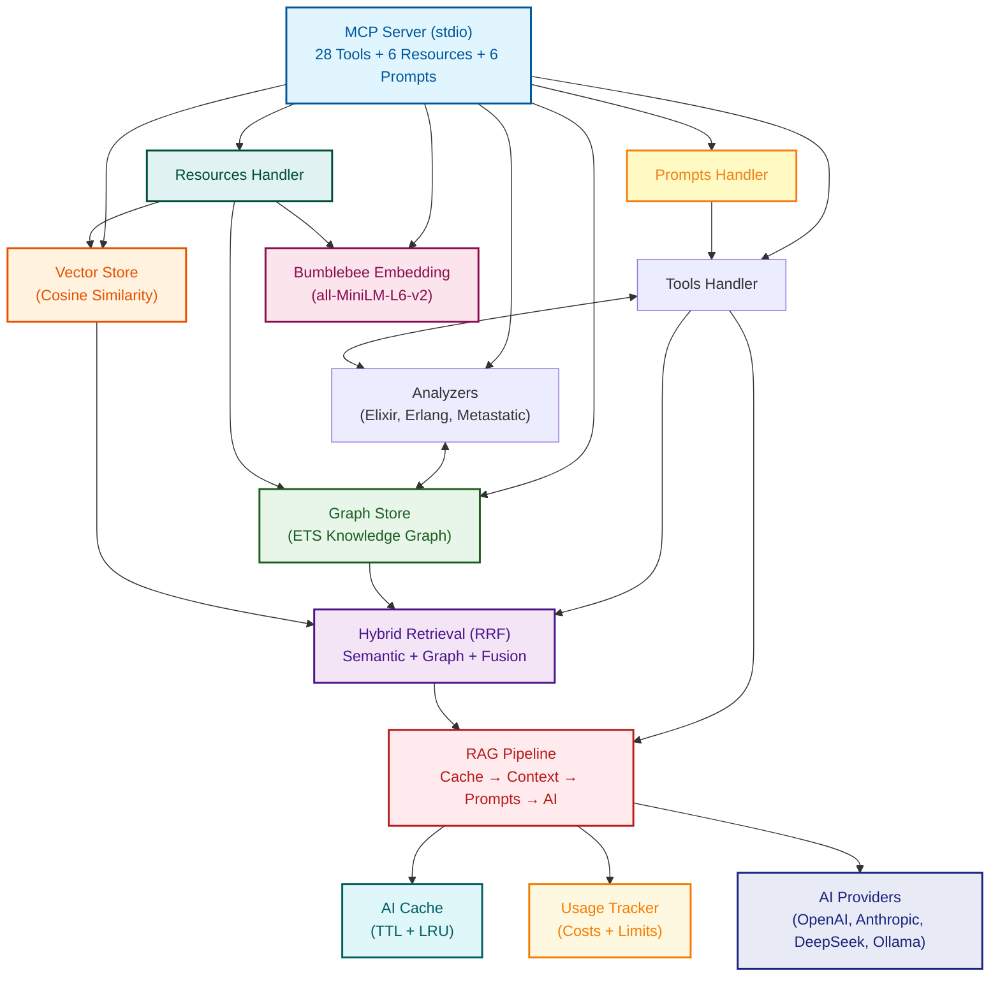

#  Ragex

**Hybrid Retrieval-Augmented Generation for Multi-Language Codebases**

Ragex is an MCP (Model Context Protocol) server that analyzes codebases using compiler output and language-native tools to build comprehensive knowledge graphs. It enables natural language querying of code structure, relationships, and semantics.

## Features

<details>
  <summary>Foundation</summary>

    ▸ MCP Server Protocol: Full JSON-RPC 2.0 implementation over both stdio and socket  
    ▸ Elixir Code Analyzer: AST-based parser extracting modules, functions, calls, and dependencies  
    ▸ Knowledge Graph: ETS-based storage for code entities and relationships  
    ▸ MCP Tools:  
      ▹ `analyze_file`: Parse and index source files  
      ▹ `query_graph`: Search for modules, functions, and relationships  
      ▹ `list_nodes`: Browse indexed code entities
</details>
<details>
  <summary>Multi-Language Support</summary>

    ▸ Erlang Analyzer: Uses `:erl_scan` and `:erl_parse` for native Erlang AST parsing  
    ▸ Python Analyzer: Shells out to Python's `ast` module for comprehensive analysis  
    ▸ JavaScript/TypeScript Analyzer: Regex-based parsing for common JS/TS patterns  
    ▸ Auto-detection: Automatically detects language from file extension  
    ▸ Directory Analysis: Batch analyze entire projects with parallel processing  
    ▸ File Watching: Auto-reindex on file changes  
    ▸ Supported Extensions: `.ex`, `.exs`, `.erl`, `.hrl`, `.py`, `.js`, `.jsx`, `.ts`, `.tsx`, `.mjs`
</details>
<details>
  <summary>Semantic Search & Hybrid Retrieval</summary>

    ▸ Embeddings Foundation  
      ▹ Local ML Model: Bumblebee integration with sentence-transformers/all-MiniLM-L6-v2  
      ▹ Vector Embeddings: 384-dimensional embeddings for code entities  
      ▹ Automatic Generation: Embeddings created during code analysis  
      ▹ Text Descriptions: Natural language descriptions for modules and functions  
      ▹ ETS Storage: Embeddings stored alongside graph entities  
      ▹ No External APIs: Fully local model inference (~400MB memory)

    ▸ Vector Store  
      ▹ Cosine Similarity: Fast vector similarity search (<50ms for 100 entities)  
      ▹ Parallel Search: Concurrent similarity calculations  
      ▹ Filtering: By node type, similarity threshold, and result limit  
      ▹ k-NN Search: Nearest neighbor queries  
      ▹ Statistics API: Vector store metrics and monitoring

    ▸ Semantic Search Tools  
      ▹ Semantic Search: Natural language code queries ("function to parse JSON")  
      ▹ Getting Embeddings Stats: ML model and vector store statistics  
      ▹ Result Enrichment: Context with callers, callees, file locations  
      ▹ Flexible Filtering: By type, threshold, limit, with context inclusion

    ▸ Hybrid Retrieval  
      ▹ Hybrid Search: Combines symbolic and semantic approaches  
      ▹ Three Strategies: Fusion (RRF), semantic-first, graph-first  
      ▹ Reciprocal Rank Fusion: Intelligent ranking combination (k=60)  
      ▹ Graph Constraints: Optional symbolic filtering  
      ▹ Performance: <100ms for typical queries

    ▸ Enhanced Graph Queries  
      ▹ PageRank: Importance scoring based on call relationships  
      ▹ Path Finding: Discover call chains between functions (with limits)  
      ▹ Degree Centrality: In-degree, out-degree, and total degree metrics  
      ▹ Graph Statistics: Comprehensive codebase analysis  
      ▹ MCP Tools: `find_paths` and `graph_stats` tools
</details>
<details>
  <summary>Production Features</summary>

    ▸ Custom Embedding Models  
      ▹ Model Registry: 4 pre-configured embedding models  
      ▹ Flexible Configuration: Config file, environment variable, or default  
      ▹ Model Compatibility: Automatic detection of compatible models (same dimensions)  
      ▹ Migration Tool: `mix ragex.embeddings.migrate` for model changes  
      ▹ Validation: Startup checks for model compatibility

    ▸ Embedding Persistence  
      ▹ Automatic Cache: Save on shutdown, load on startup  
      ▹ Model Validation: Ensures cache matches current model  
      ▹ Project-Specific: Isolated caches per project directory  
      ▹ Cache Management: Mix tasks for stats and cleanup (`mix ragex.cache.*`)  
      ▹ Performance: Cold start <5s vs 50s without cache  
      ▹ Storage: ~15MB per 1,000 entities (ETS binary format)

    ▸ Incremental Embedding Updates  
      ▹ File Tracking: SHA256 content hashing for change detection  
      ▹ Smart Diff: Only re-analyzes changed files  
      ▹ Selective Regeneration: Updates embeddings for modified entities only  
      ▹ Performance: <5% regeneration on single-file changes  
      ▹ Mix Task: `mix ragex.cache.refresh` for incremental/full updates

    ▸ Path Finding Limits  
      ▹ `max_paths` Parametrization: Limits returned paths (default: 100) to prevent hangs  
      ▹ Early Stopping: DFS traversal stops when max_paths reached  
      ▹ Dense Graph Detection: Automatic warnings for highly-connected nodes (≥10 edges)  
      ▹ Configurable Options: max_depth, max_paths, warn_dense flags  
      ▹ Performance: Prevents exponential explosion on dense graphs
</details>
<details>
  <summary>Code Editing Capabilities</summary>

    ▸ Core Editor Infrastructure  
      ▹ Editor Types: Change types (replace, insert, delete) with validation  
      ▹ Backup Management: Automatic backups with timestamps and project-specific directories  
      ▹ Core Editor: Atomic operations with concurrent modification detection  
      ▹ Rollback Support: Restore previous versions from backup history  
      ▹ Configuration: Backup retention, compression, and directory settings

    ▸ Validation Pipeline  
      ▹ Validator Behavior: Behavior definition with callbacks and orchestration  
      ▹ Elixir Validator: Syntax validation using `Code.string_to_quoted/2`  
      ▹ Erlang Validator: Validation using `:erl_scan` and `:erl_parse`  
      ▹ Python Validator: Shell-out to Python's `ast.parse()` for syntax checking  
      ▹ JavaScript Validator: Node.js `vm.Script` for JS/TS validation  
      ▹ Automatic Detection: Language detection from file extension  
      ▹ Core Integration: Validators integrated with `Core.edit_file`

    ▸ MCP Edit Tools  
      ▹ edit_file: MCP tool for safe file editing with validation  
      ▹ validate_edit: Preview validation before applying changes  
      ▹ rollback_edit: Undo recent edits via MCP  
      ▹ edit_history: Query backup history  

    ▸ Advanced Editing  
      ▹ Format Integration: Auto-format after edits with language-specific formatters  
      ▹ Formatter Detection: Automatic formatter discovery (mix, rebar3, black, prettier)  
      ▹ Core Integration: `:format` option in `Core.edit_file`  
      ▹ Multi-file Transactions: Atomic cross-file changes with automatic rollback  
      ▹ Transaction Validation: Pre-validate all files before applying changes  
      ▹ MCP Integration: `edit_files` tool for coordinated multi-file edits

    ▸ Semantic Refactoring  
      ▹ AST Manipulation: Elixir-specific AST parsing and transformation  
      ▹ Rename Function: Rename functions with automatic call site updates  
      ▹ Rename Module: Rename modules with reference updates  
      ▹ Graph Integration: Use knowledge graph to find all affected files  
      ▹ Arity Support: Handle functions with multiple arities correctly  
      ▹ Scope Control: Module-level or project-wide refactoring  
      ▹ MCP Integration: `refactor_code` tool for semantic refactoring

    ▸ Advanced Refactoring
      ▹ Extract Function: Extract code range into new function (basic support)  
      ▹ Inline Function: Replace all calls with function body, remove definition (fully working)  
      ▹ Convert Visibility: Toggle between `def` and `defp` (fully working)  
      ▹ Rename Parameter: Rename parameter within function scope (fully working)  
      ▹ Modify Attributes: Add/remove/update module attributes (fully working)  
      ▹ Change Signature: Add/remove/reorder/rename parameters with call site updates (fully working)  
      ▹ Move Function: Move function between modules (deferred - requires advanced semantic analysis)  
      ▹ Extract Module: Extract multiple functions into new module (deferred - requires advanced semantic analysis)  
      ▹ MCP Integration: `advanced_refactor` tool with 8 operation types  
      ▹ Status: 6 of 8 operations fully functional, 2 deferred pending semantic analysis enhancements
</details>
<details>
  <summary>Advanced Graph Algorithms</summary>

    ▸ Centrality Metrics  
      ▹ Betweenness Centrality: Identify bridge/bottleneck functions using Brandes’ algorithm  
      ▹ Closeness Centrality: Identify central functions based on average distance  
      ▹ Normalized Scores: Configurable 0-1 normalization  
      ▹ Performance Limits: `max_nodes` parameter for large graphs  
      ▹ MCP Tools: `betweenness_centrality` and `closeness_centrality`

    ▸ Community Detection  
      ▹ Louvain Method: Modularity optimization for discovering architectural modules  
      ▹ Label Propagation: Fast alternative algorithm (O(m) per iteration)  
      ▹ Hierarchical Structure: Multi-level community detection support  
      ▹ Weighted Edges: Support for edge weights (call frequency)  
      ▹ MCP Tool: `detect_communities` with algorithm selection

    ▸ Weighted Graph Support  
      ▹ Edge Weights: Store call frequency in edge metadata (default: 1.0)  
      ▹ Weighted Algorithms: Modularity computation with weights  
      ▹ Store Integration: `get_edge_weight` helper function

    ▸ Graph Visualization  
      ▹ Graphviz DOT Export: Community clustering, colored nodes, weighted edges  
      ▹ D3.js JSON Export: Force-directed graph format with metadata  
      ▹ Node Coloring: By PageRank, betweenness, or degree centrality  
      ▹ Edge Thickness: Proportional to edge weight  
      ▹ MCP Tool: `export_graph` with format selection
</details>
<details>
  <summary>MCP Resources & Prompts</summary>

    ▸ Resources (Read-only State Access)  
      ▹ Graph Statistics: Node/edge counts, PageRank scores, centrality metrics  
      ▹ Cache Status: Embedding cache health, file tracking, stale entities  
      ▹ Model Configuration: Active model details, capabilities, readiness  
      ▹ Project Index: Tracked files, language distribution, entity counts  
      ▹ Algorithm Catalog: Available algorithms with parameters and complexity  
      ▹ Analysis Summary: Pre-computed architectural insights and communities  
      ▹ URI Format: `ragex://<category>/<resource>`  
      ▹ Documentation: See [RESOURCES.md](RESOURCES.md)

    ▸ Prompts (High-level Workflows)  
      ▹ Analyze Architecture: Comprehensive architectural analysis (shallow/deep)  
      ▹ Find Impact: Function importance and refactoring risk assessment  
      ▹ Explain Code Flow: Narrative execution flow between functions  
      ▹ Find Similar Code: Hybrid search with natural language descriptions  
      ▹ Suggest Refactoring: Modularity, coupling, and complexity analysis  
      ▹ Safe Rename: Impact preview for semantic refactoring operations  
      ▹ Tool Composition: Each prompt suggests sequence of tools to use  
      ▹ Documentation: See [PROMPTS.md](PROMPTS.md)
</details>
<details>
  <summary>RAG System (:fire:)</summary>

    ▸ AI Provider Abstraction  
      ▹ Provider Behaviour: Clean interface for multiple AI providers  
      ▹ DeepSeek R1: Full integration with deepseek-chat and deepseek-reasoner models  
      ▹ Streaming Support: All providers support streaming responses (SSE/NDJSON)  
      ▹ Real-time Responses: Progressive content delivery with token usage tracking  
      ▹ OpenAI: GPT-4, GPT-4-turbo, GPT-3.5-turbo support  
      ▹ Anthropic: Claude 3 Opus, Sonnet, and Haiku models  
      ▹ Ollama: Local LLM support (llama2, mistral, codellama, phi)  
      ▹ Configuration System: Multi-provider with fallback support  
      ▹ Provider Registry: GenServer for runtime provider management

    ▸ AI Response Caching  
      ▹ ETS-based Cache: SHA256 key generation with TTL expiration  
      ▹ LRU Eviction: Automatic eviction when max size reached  
      ▹ Operation-specific TTL: Configurable per operation type  
      ▹ Cache Statistics: Hit rate, misses, puts, evictions tracking  
      ▹ Mix Tasks: `mix ragex.ai.cache.stats` and `mix ragex.ai.cache.clear`  
      ▹ Performance: >50% cache hit rate for repeated queries

    ▸ Usage Tracking & Rate Limiting  
      ▹ Per-provider Tracking: Requests, tokens, and cost estimation  
      ▹ Real-time Costs: Accurate pricing for OpenAI, Anthropic, DeepSeek  
      ▹ Time-windowed Limits: Per-minute, per-hour, per-day controls  
      ▹ Automatic Enforcement: Rate limit checks before API calls  
      ▹ Mix Tasks: `mix ragex.ai.usage.stats` for monitoring  
      ▹ MCP Tools: `get_ai_usage`, `get_ai_cache_stats`

    ▸ Metastatic Integration  
      ▹ MetaAST Analyzer: Enhanced cross-language analysis via Metastatic library  
      ▹ Supported Languages: Elixir, Erlang, Python, Ruby  
      ▹ Fallback Strategy: Graceful degradation to native analyzers  
      ▹ Feature Flags: Configurable `use_metastatic` option

    ▸ RAG Pipeline  
      ▹ Context Builder: Format retrieval results for AI consumption (8000 char max)  
      ▹ Prompt Templates: Query, explain, and suggest operations  
      ▹ Full Pipeline: Retrieval → Context → Prompting → Generation → Post-processing  
      ▹ Hybrid Retrieval: Leverages semantic + graph-based search  
      ▹ Cache Integration: Automatic caching of AI responses  
      ▹ Usage Tracking: All requests tracked with cost estimation

    ▸ MCP RAG Tools  
      ▹ `rag_query`: Answer general codebase questions with AI  
      ▹ `rag_explain`: Explain code with aspect focus (purpose, complexity, dependencies, all)  
      ▹ `rag_suggest`: Suggest improvements (performance, readability, testing, security, all)  
      ▹ `rag_query_stream`: Streaming version of rag_query (internally uses streaming)  
      ▹ `rag_explain_stream`: Streaming version of rag_explain (internally uses streaming)  
      ▹ `rag_suggest_stream`: Streaming version of rag_suggest (internally uses streaming)  
      ▹ `get_ai_usage`: Query usage statistics and costs per provider  
      ▹ `get_ai_cache_stats`: View cache performance metrics  
      ▹ `clear_ai_cache`: Clear cache via MCP  
      ▹ Provider Override: Select provider per-query (openai, anthropic, deepseek_r1, ollama)  

    ▸ MetaAST-Enhanced Retrieval
      ▹ Context-Aware Ranking: Query intent detection (explain, refactor, example, debug)  
      ▹ Purity Analysis: Boost pure functions, penalize side effects  
      ▹ Complexity Scoring: Favor simple code for explanations, complex code for refactoring  
      ▹ Cross-Language Search: Find equivalent constructs across languages via MetaAST  
      ▹ Query Expansion: Automatic synonym injection and cross-language terms  
      ▹ Pattern Search: Find all implementations of MetaAST patterns (map, filter, lambda, etc.)  
      ▹ Hybrid Integration: MetaAST ranking applied to all search strategies  
      ▹ MCP Tools: `metaast_search`, `cross_language_alternatives`, `expand_query`, `find_metaast_pattern`  
</details>
<details>
  <summary>Code Analysis & Quality</summary>

    ▸ Dead Code Detection  
      ▹ Graph-Based Analysis: Find unused functions via call graph traversal  
      ▹ Confidence Scoring: 0.0-1.0 score to distinguish callbacks from dead code  
      ▹ Pattern Detection: AST-based unreachable code detection via Metastatic  
      ▹ Intraprocedural Analysis: Constant conditionals, unreachable branches  
      ▹ Interprocedural Analysis: Unused exports, private functions  
      ▹ Callback Recognition: GenServer, Phoenix, and other framework callbacks  
      ▹ MCP Tools: `find_dead_code`, `analyze_dead_code_patterns`

    ▸ Dependency Analysis  
      ▹ Coupling Metrics: Afferent (Ca) and Efferent (Ce) coupling  
      ▹ Instability: I = Ce / (Ca + Ce) ranges from 0 (stable) to 1 (unstable)  
      ▹ Circular Dependencies: Detect cycles at module and function levels  
      ▹ Transitive Dependencies: Optional deep dependency traversal  
      ▹ God Module Detection: Find modules with high coupling  
      ▹ MCP Tools: `analyze_dependencies`, `find_circular_dependencies`, `coupling_report`

    ▸ Code Duplication Detection  
      ▹ AST-Based Clones: Type I-IV clone detection via Metastatic  
      ▹ Type I: Exact clones (whitespace/comment differences only)  
      ▹ Type II: Renamed clones (same structure, different identifiers)  
      ▹ Type III: Near-miss clones (similar with modifications, configurable threshold)  
      ▹ Type IV: Semantic clones (different syntax, same behavior)  
      ▹ Embedding-Based Similarity: Semantic code similarity using ML embeddings  
      ▹ Directory Scanning: Recursive multi-file analysis with exclusion patterns  
      ▹ Reports: Summary, detailed, and JSON formats  
      ▹ MCP Tools: `find_duplicates`, `find_similar_code`

    ▸ Impact Analysis
      ▹ Change Impact: Predict affected code via graph traversal  
      ▹ Risk Scoring: Combine importance (PageRank) + coupling + complexity  
      ▹ Test Discovery: Find affected tests automatically  
      ▹ Effort Estimation: Estimate refactoring time/complexity for 6 operations  
      ▹ Risk Levels: Low (<0.3), medium (0.3-0.6), high (0.6-0.8), critical (≥0.8)  
      ▹ Complexity Levels: Low (<5 changes), medium (5-20), high (20-50), very high (50+)  
      ▹ Support Operations: rename_function, rename_module, extract_function, inline_function, move_function, change_signature  
      ▹ MCP Tools: `analyze_impact`, `estimate_refactoring_effort`, `risk_assessment`

    ▸ Quality Metrics (Metastatic Integration)  
      ▹ Complexity Metrics: Cyclomatic, cognitive, nesting depth  
      ▹ Halstead Metrics: Difficulty and effort calculations  
      ▹ Lines of Code: Physical LOC counting  
      ▹ Purity Analysis: Function purity and side-effect detection  
      ▹ Function Metrics: Per-function analysis  
      ▹ Project-wide Reports: Aggregated statistics by language  
      ▹ MCP Tools: `analyze_quality`, `quality_report`, `find_complex_code`

    ▸ Documentation  
      ▹ Comprehensive Guide: See [ANALYSIS.md](ANALYSIS.md) for complete API documentation  
      ▹ Analysis Approaches: AST-based vs embedding-based strategies  
      ▹ Usage Examples: API and MCP tool examples with code snippets  
      ▹ Best Practices: Threshold recommendations, workflow tips  
      ▹ Troubleshooting: Common issues and solutions  
      ▹ CI/CD Integration: Pre-commit hooks, pipeline examples
</details>

### Planned Features

- [x] Streaming RAG responses
- [x] MCP streaming notifications
- [x] MetaAST-enhanced retrieval
- [x] Code quality analysis
- [x] Impact analysis and risk assessment
- [ ] Provider health checks and auto-failover
- [ ] Production optimizations
- [ ] Additional language support
- [ ] Cross-language refactoring via Metastatic
- [ ] Developer experience improvements

## Architecture



## Use as MCP Server

The only MCP client currently supported is `LunarVim` (technically, any `NeoVim`,
but I never tested it.)

To enable `Ragex` support in `LunarVim`, copy files from `lvim.cfg/lua/user/` to
where your `LunarVim` configs are (typically, it’s `~/.config/lvim/lua/user/`) and
amend your `config.lua` as shown below.

```lua
-- Ragex integration
local ragex = require("user.ragex")
local ragex_telescope = require("user.ragex_telescope")

-- Setup Ragex with configuration
ragex.setup({
  ragex_path = vim.fn.expand("~/Proyectos/Ammotion/ragex"),
  enabled = true,
  debug = false,
})

-- Ragex keybindings (using "r" prefix for Ragex)
lvim.builtin.which_key.mappings["r"] = {
  name = "Ragex",
  s = { function() ragex_telescope.ragex_search() end, "Semantic Search" },
  w = { function() ragex_telescope.ragex_search_word() end, "Search Word" },
  f = { function() ragex_telescope.ragex_functions() end, "Find Functions" },
  m = { function() ragex_telescope.ragex_modules() end, "Find Modules" },
  a = { function() ragex.analyze_current_file() end, "Analyze File" },
  d = { function() ragex.analyze_directory(vim.fn.getcwd()) end, "Analyze Directory" },
  c = { function() ragex.show_callers() end, "Find Callers" },
  r = {
    function()
      vim.ui.input({ prompt = "New name: " }, function(name)
        if name then
          ragex.rename_function(name)
        end
      end)
    end,
    "Rename Function",
  },
  R = {
    function()
      vim.ui.input({ prompt = "Old module: " }, function(old_name)
        if old_name then
          vim.ui.input({ prompt = "New module: " }, function(new_name)
            if new_name then
              ragex.rename_module(old_name, new_name)
            end
          end)
        end
      end)
    end,
    "Rename Module",
  },
  g = { 
    function()
      local result = ragex.graph_stats()
      if result and result.result then
        -- Unwrap MCP response
        local stats = result.result
        if stats.content and stats.content[1] and stats.content[1].text then
          local ok, parsed = pcall(vim.fn.json_decode, stats.content[1].text)
          if ok then
            stats = parsed
          end
        end
        
        -- Format stats for display
        local lines = {
          "# Graph Statistics",
          "",
          string.format("**Nodes**: %d", stats.node_count or 0),
          string.format("**Edges**: %d", stats.edge_count or 0),
          string.format("**Average Degree**: %.2f", stats.average_degree or 0),
          string.format("**Density**: %.4f", stats.density or 0),
          "",
          "## Node Types",
        }
        
        if stats.node_counts_by_type then
          for node_type, count in pairs(stats.node_counts_by_type) do
            table.insert(lines, string.format("- %s: %d", node_type, count))
          end
        end
        
        if stats.top_by_degree and #stats.top_by_degree > 0 then
          table.insert(lines, "")
          table.insert(lines, "## Top by Degree")
          for i, node in ipairs(stats.top_by_degree) do
            if i > 10 then break end
            table.insert(lines, string.format("- %s (in:%d, out:%d, total:%d)",
              node.node_id or "unknown",
              node.in_degree or 0,
              node.out_degree or 0,
              node.total_degree or 0))
          end
        end
        
        ragex.show_in_float("Ragex Graph Statistics", lines)
      else
        vim.notify("No graph statistics available", vim.log.levels.WARN)
      end
    end,
    "Graph Stats"
  },
  W = { function() ragex.watch_directory(vim.fn.getcwd()) end, "Watch Directory" },
  t = { function() ragex.toggle_auto_analyze() end, "Toggle Auto-Analysis" },
  -- Advanced Graph Algorithms
  b = { function() ragex.show_betweenness_centrality() end, "Betweenness Centrality" },
  o = { function() ragex.show_closeness_centrality() end, "Closeness Centrality" },
  n = { function() ragex.show_communities("louvain") end, "Detect Communities (Louvain)" },
  l = { function() ragex.show_communities("label_propagation") end, "Detect Communities (Label Prop)" },
  e = { 
    function()
      vim.ui.select({ "graphviz", "d3" }, {
        prompt = "Export format:",
      }, function(format)
        if format then
          local ext = format == "graphviz" and "dot" or "json"
          vim.ui.input({
            prompt = "Save as: ",
            default = vim.fn.getcwd() .. "/graph." .. ext,
          }, function(filepath)
            if filepath then
              ragex.export_graph_to_file(format, filepath)
            end
          end)
        end
      end)
    end,
    "Export Graph"
  },
}

-- Register Telescope commands for Ragex
vim.api.nvim_create_user_command("RagexSearch", ragex_telescope.ragex_search, {})
vim.api.nvim_create_user_command("RagexFunctions", ragex_telescope.ragex_functions, {})
vim.api.nvim_create_user_command("RagexModules", ragex_telescope.ragex_modules, {})
vim.api.nvim_create_user_command("RagexSearchWord", ragex_telescope.ragex_search_word, {})
vim.api.nvim_create_user_command("RagexToggleAuto", function() ragex.toggle_auto_analyze() end, {})

-- Add Ragex status to lualine
local function ragex_status()
  if ragex.config.enabled then
    return "  Ragex"
  end
  return ""
end
```

This should result in the following `<leader>r` update:


## Installation

### Prerequisites

- Elixir 1.19 or later
- Erlang/OTP 28 or later
- Python 3.x (optional, for Python code analysis)
- Node.JS (optional, for Javascript code analysis)
- ~500MB RAM for embedding model (first run downloads ~90MB)

### Build

```bash
cd ragex
mix deps.get
mix compile
```

**Note**: First compilation will take longer due to ML dependencies. The embedding model (~90MB) will download on first run and be cached at `~/.cache/huggingface/`.

## Usage

### As an MCP Server

Run the server (it will listen on both stdin and socket):

```bash
./start_mcp.sh
```

**Note**: The stdio server is validated and production-ready. See [STDIO_VALIDATION.md](STDIO_VALIDATION.md) for testing details and MCPHub integration guide.

### MCP Protocol Example

Initialize the server:

```json
{"jsonrpc":"2.0","method":"initialize","params":{"clientInfo":{"name":"test-client","version":"1.0"}},"id":1}
```

List available tools:

```json
{"jsonrpc":"2.0","method":"tools/list","id":2}
```

Analyze a file (with auto-detection):

```json
{
  "jsonrpc": "2.0",
  "method": "tools/call",
  "params": {
    "name": "analyze_file",
    "arguments": {
      "path": "lib/ragex.ex"
    }
  },
  "id": 3
}
```

Or specify the language explicitly:

```json
{
  "jsonrpc": "2.0",
  "method": "tools/call",
  "params": {
    "name": "analyze_file",
    "arguments": {
      "path": "script.py",
      "language": "python"
    }
  },
  "id": 3
}
```

Query the graph:

```json
{
  "jsonrpc": "2.0",
  "method": "tools/call",
  "params": {
    "name": "query_graph",
    "arguments": {
      "query_type": "find_module",
      "params": {"name": "Ragex"}
    }
  },
  "id": 4
}
```

## Development

### Running Tests

```bash
mix test
```

### Interactive Development

```bash
RAGEX_NO_SERVER=1 iex -S mix
```

```elixir
# Analyze a file
{:ok, content} = File.read("lib/ragex.ex")
{:ok, analysis} = Ragex.Analyzers.Elixir.analyze(content, "lib/ragex.ex")

# Check graph stats, it’s expected to be empty for this single file
Ragex.stats()
```

## MCP Tools Reference

### Core Analysis Tools

#### `analyze_file`

Analyzes a source file and extracts code structure into the knowledge graph.

**Parameters:**
- `path` (string, required): Path to the file
- `language` (string, optional): Programming language - `elixir`, `erlang`, `python`, `javascript`, `typescript`, or `auto` (default: auto-detect from extension)
- `generate_embeddings` (boolean, optional): Generate embeddings for semantic search (default: true)

#### `analyze_directory`

Batch analyzes all source files in a directory.

**Parameters:**
- `path` (string, required): Directory path
- `language` (string, optional): Language to filter files (default: auto-detect)
- `recursive` (boolean, optional): Recursively analyze subdirectories (default: true)
- `generate_embeddings` (boolean, optional): Generate embeddings (default: true)

#### `query_graph`

Queries the knowledge graph for code entities and relationships (symbolic search).

**Parameters:**
- `query_type` (string, required): Type of query
  - `find_module`: Find a module by name
  - `find_function`: Find a function by module and name
  - `get_calls`: Get function call relationships
  - `get_dependencies`: Get module dependencies
- `params` (object, required): Query-specific parameters

#### `list_nodes`

Lists all nodes in the knowledge graph with optional filtering.

**Parameters:**
- `node_type` (string, optional): Filter by type (module, function, etc.)
- `limit` (integer, optional): Maximum results (default: 100)

### File Watching Tools

#### `watch_directory`

Automatically re-index files when they change.

**Parameters:**
- `path` (string, required): Directory to watch

#### `unwatch_directory`

Stop watching a directory.

**Parameters:**
- `path` (string, required): Directory to stop watching

#### `list_watched`

List all watched directories.

**Parameters:** None

### Semantic Search Tools

#### `semantic_search`

Performs natural language code search using vector embeddings.

**Parameters:**
- `query` (string, required): Natural language query (e.g., "function to parse JSON")
- `limit` (integer, optional): Maximum results (default: 10)
- `threshold` (number, optional): Minimum similarity score 0.0-1.0 (default: 0.7)
- `node_type` (string, optional): Filter by type (module, function)
- `include_context` (boolean, optional): Include caller/callee context (default: false)

**Example:**
```json
{
  "query": "HTTP request handler",
  "limit": 5,
  "threshold": 0.75,
  "node_type": "function"
}
```

#### `hybrid_search`

Combines symbolic graph queries with semantic search for best results.

**Parameters:**
- `query` (string, required): Search query
- `strategy` (string, optional): Search strategy:
  - `fusion` (default): RRF fusion of both approaches
  - `semantic_first`: Semantic search then graph filtering
  - `graph_first`: Graph query then semantic ranking
- `limit` (integer, optional): Maximum results (default: 10)
- `threshold` (number, optional): Minimum similarity (default: 0.7)
- `graph_filter` (object, optional): Optional symbolic constraints
- `include_context` (boolean, optional): Include context (default: false)

**Example:**
```json
{
  "query": "database connection",
  "strategy": "fusion",
  "limit": 10,
  "graph_filter": {"module": "DB"}
}
```

#### `get_embeddings_stats`

Returns ML model and vector store statistics.

**Parameters:** None

**Returns:**
- Model information (name, dimensions, status)
- Vector store metrics (total embeddings, by type)
- Graph statistics (nodes, edges)

### Code Editing Tools

#### `edit_file`

Safely edit a single file with automatic backup, validation, and atomic operations.

**Parameters:**
- `path` (string, required): Path to the file to edit
- `changes` (array, required): List of changes to apply
  - `type` (string): `replace`, `insert`, or `delete`
  - `line_start` (integer): Starting line number (1-indexed)
  - `line_end` (integer): Ending line number (for replace/delete)
  - `content` (string): New content (for replace/insert)
- `validate` (boolean, optional): Validate syntax before applying (default: true)
- `create_backup` (boolean, optional): Create backup before editing (default: true)
- `format` (boolean, optional): Format code after editing (default: false)
- `language` (string, optional): Explicit language for validation (auto-detected from extension)

**Example:**
```json
{
  "path": "lib/my_module.ex",
  "changes": [
    {
      "type": "replace",
      "line_start": 10,
      "line_end": 15,
      "content": "def new_function do\n  :ok\nend"
    }
  ],
  "validate": true,
  "format": true
}
```

#### `edit_files`

Atomically edit multiple files with coordinated rollback on failure.

**Parameters:**
- `files` (array, required): List of files to edit
  - `path` (string): Path to the file
  - `changes` (array): List of changes (same format as `edit_file`)
  - `validate` (boolean, optional): Override transaction-level validation
  - `format` (boolean, optional): Override transaction-level formatting
  - `language` (string, optional): Explicit language for this file
- `validate` (boolean, optional): Validate all files before applying (default: true)
- `create_backup` (boolean, optional): Create backups for all files (default: true)
- `format` (boolean, optional): Format all files after editing (default: false)

**Example:**
```json
{
  "files": [
    {
      "path": "lib/module_a.ex",
      "changes": [{"type": "replace", "line_start": 5, "line_end": 5, "content": "@version \"2.0.0\""}]
    },
    {
      "path": "lib/module_b.ex",
      "changes": [{"type": "replace", "line_start": 10, "line_end": 12, "content": "# Updated"}]
    }
  ],
  "validate": true,
  "format": true
}
```

#### `validate_edit`

Preview validation of changes without applying them.

**Parameters:**
- `path` (string, required): Path to the file
- `changes` (array, required): List of changes to validate
- `language` (string, optional): Explicit language for validation

#### `rollback_edit`

Undo a recent edit by restoring from backup.

**Parameters:**
- `path` (string, required): Path to the file to rollback
- `backup_id` (string, optional): Specific backup to restore (default: most recent)

#### `edit_history`

Query backup history for a file.

**Parameters:**
- `path` (string, required): Path to the file
- `limit` (integer, optional): Maximum number of backups to return (default: 10)

#### `refactor_code`

Semantic refactoring operations using AST analysis and knowledge graph.

**Parameters:**
- `operation` (string, required): Type of refactoring - `rename_function` or `rename_module`
- `params` (object, required): Operation-specific parameters
  - For `rename_function`:
    - `module` (string): Module containing the function
    - `old_name` (string): Current function name
    - `new_name` (string): New function name
    - `arity` (integer): Function arity
  - For `rename_module`:
    - `old_name` (string): Current module name
    - `new_name` (string): New module name
- `scope` (string, optional): `module` (same file only) or `project` (all files, default: project)
- `validate` (boolean, optional): Validate before/after (default: true)
- `format` (boolean, optional): Format code after (default: true)

**Example - Rename Function:**
```json
{
  "operation": "rename_function",
  "params": {
    "module": "MyModule",
    "old_name": "old_function",
    "new_name": "new_function",
    "arity": 2
  },
  "scope": "project",
  "validate": true,
  "format": true
}
```

**Example - Rename Module:**
```json
{
  "operation": "rename_module",
  "params": {
    "old_name": "OldModule",
    "new_name": "NewModule"
  },
  "validate": true
}
```

### RAG (AI-Powered) Tools

#### `rag_query`

Query the codebase using Retrieval-Augmented Generation with AI assistance.

**Parameters:**
- `query` (string, required): Natural language query about the codebase
- `limit` (integer, optional): Maximum number of code snippets to retrieve (default: 10)
- `include_code` (boolean, optional): Include full code snippets in context (default: true)
- `provider` (string, optional): AI provider override (`deepseek_r1`)

**Example:**
```json
{
  "query": "How does authentication work in this codebase?",
  "limit": 15,
  "include_code": true
}
```

**Returns:**
- AI-generated response based on retrieved code context
- Sources count and model information

#### `rag_explain`

Explain code using RAG with AI assistance and aspect-focused analysis.

**Parameters:**
- `target` (string, required): File path or function identifier (e.g., `MyModule.function/2`)
- `aspect` (string, optional): What to explain - `purpose`, `complexity`, `dependencies`, or `all` (default: `all`)

**Example:**
```json
{
  "target": "Ragex.Graph.Store.add_node/3",
  "aspect": "complexity"
}
```

**Returns:**
- AI-generated explanation based on code analysis
- Related code context and dependencies

#### `rag_suggest`

Suggest code improvements using RAG with AI analysis.

**Parameters:**
- `target` (string, required): File path or function identifier
- `focus` (string, optional): Improvement focus - `performance`, `readability`, `testing`, `security`, or `all` (default: `all`)

**Example:**
```json
{
  "target": "lib/ragex/editor/core.ex",
  "focus": "performance"
}
```

**Returns:**
- AI-generated improvement suggestions
- Code context and rationale

**Configuration:**

RAG tools require the `DEEPSEEK_API_KEY` environment variable:

```bash
export DEEPSEEK_API_KEY="sk-xxxxxxxxxxxxx"
```

## Documentation

- [Algorithms](stuff/docs/ALGORITHMS.md) - Algorithms used
- [Usage](stuff/docs/USAGE.md) - Tips on how to use `Ragex`
- [Configuration](stuff/docs/CONFIGURATION.md) - Embedding model configuration and migration
- [Persistence](stuff/docs/PERSISTENCE.md) - Embedding cache management and performance
- [Analysis](stuff/docs/ANALYSIS.md) - Embedding cache management and performance

### Cache Management

Ragex automatically caches embeddings for faster startup:

```bash
# View cache statistics
mix ragex.cache.stats

# Clear current project cache
mix ragex.cache.clear --current

# Clear all caches
mix ragex.cache.clear --all --force
```

## Supported Languages

| Language | Extensions | Parser | Status |
|----------|-----------|--------|--------|
| Elixir | `.ex`, `.exs` | Native AST (`Code.string_to_quoted`) | ✓ Full |
| Erlang | `.erl`, `.hrl` | Native AST (`:erl_scan`, `:erl_parse`) | ✓ Full |
| Python | `.py` | Python `ast` module (subprocess) | ✓ Full |
| JavaScript/TypeScript | `.js`, `.jsx`, `.ts`, `.tsx`, `.mjs` | Regex-based | ✗ Basic |
