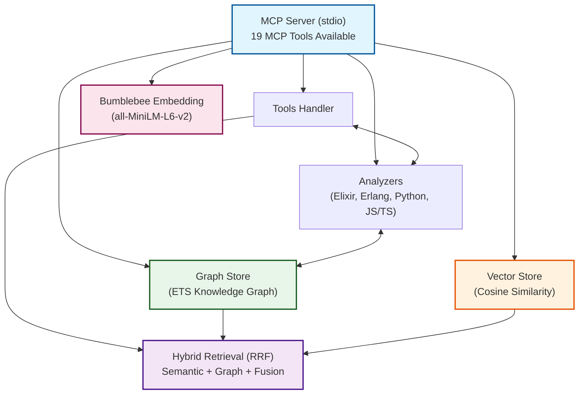

# Ragex

**Hybrid Retrieval-Augmented Generation for Multi-Language Codebases**

Ragex is an MCP (Model Context Protocol) server that analyzes codebases using compiler output and language-native tools to build comprehensive knowledge graphs. It enables natural language querying of code structure, relationships, and semantics.

## Features

<details>
  <summary>Foundation</summary>

  ▸ MCP Server Protocol: Full JSON-RPC 2.0 implementation over both stdio and socket  
  ▸ Elixir Code Analyzer: AST-based parser extracting modules, functions, calls, and dependencies  
  ▸ Knowledge Graph: ETS-based storage for code entities and relationships  
  ▸ MCP Tools:  
    ▹ `analyze_file`: Parse and index source files  
    ▹ `query_graph`: Search for modules, functions, and relationships  
    ▹ `list_nodes`: Browse indexed code entities
</details>
<details>
  <summary>Multi-Language Support</summary>

  ▸ Erlang Analyzer: Uses `:erl_scan` and `:erl_parse` for native Erlang AST parsing
  ▸ Python Analyzer: Shells out to Python's `ast` module for comprehensive analysis
  ▸ JavaScript/TypeScript Analyzer: Regex-based parsing for common JS/TS patterns
  ▸ Auto-detection: Automatically detects language from file extension
  ▸ Directory Analysis: Batch analyze entire projects with parallel processing
  ▸ File Watching: Auto-reindex on file changes
  ▸ Supported Extensions: `.ex`, `.exs`, `.erl`, `.hrl`, `.py`, `.js`, `.jsx`, `.ts`, `.tsx`, `.mjs`
</details>
<details>
  <summary>Semantic Search & Hybrid Retrieval</summary>

  ▸ Embeddings Foundation
    ▹ Local ML Model: Bumblebee integration with sentence-transformers/all-MiniLM-L6-v2
    ▹ Vector Embeddings: 384-dimensional embeddings for code entities
    ▹ Automatic Generation: Embeddings created during code analysis
    ▹ Text Descriptions: Natural language descriptions for modules and functions
    ▹ ETS Storage: Embeddings stored alongside graph entities
    ▹ No External APIs: Fully local model inference (~400MB memory)

  ▸ Vector Store
    ▹ Cosine Similarity: Fast vector similarity search (<50ms for 100 entities)
    ▹ Parallel Search: Concurrent similarity calculations
    ▹ Filtering: By node type, similarity threshold, and result limit
    ▹ k-NN Search: Nearest neighbor queries
    ▹ Statistics API: Vector store metrics and monitoring

  ▸ Semantic Search Tools
    ▹ Semantic Search: Natural language code queries ("function to parse JSON")
    ▹ Getting Embeddings Stats: ML model and vector store statistics
    ▹ Result Enrichment: Context with callers, callees, file locations
    ▹ Flexible Filtering: By type, threshold, limit, with context inclusion

  ▸ Hybrid Retrieval
    ▹ Hybrid Search: Combines symbolic and semantic approaches
    ▹ Three Strategies: Fusion (RRF), semantic-first, graph-first
    ▹ Reciprocal Rank Fusion: Intelligent ranking combination (k=60)
    ▹ Graph Constraints: Optional symbolic filtering
    ▹ Performance: <100ms for typical queries

  ▸ Enhanced Graph Queries
    ▹ PageRank: Importance scoring based on call relationships
    ▹ Path Finding: Discover call chains between functions (with Phase 4D limits)
    ▹ Degree Centrality: In-degree, out-degree, and total degree metrics
    ▹ Graph Statistics: Comprehensive codebase analysis
    ▹ MCP Tools: `find_paths` and `graph_stats` tools
</details>
<details>
  <summary>Production Features</summary>

  ▸ Custom Embedding Models
    ▹ Model Registry: 4 pre-configured embedding models
    ▹ Flexible Configuration: Config file, environment variable, or default
    ▹ Model Compatibility: Automatic detection of compatible models (same dimensions)
    ▹ Migration Tool: `mix ragex.embeddings.migrate` for model changes
    ▹ Validation: Startup checks for model compatibility

  ▸ Embedding Persistence
    ▹ Automatic Cache: Save on shutdown, load on startup
    ▹ Model Validation: Ensures cache matches current model
    ▹ Project-Specific: Isolated caches per project directory
    ▹ Cache Management: Mix tasks for stats and cleanup (`mix ragex.cache.*`)
    ▹ Performance: Cold start <5s vs 50s without cache
    ▹ Storage: ~15MB per 1,000 entities (ETS binary format)

  ▸ Incremental Embedding Updates
    ▹ File Tracking: SHA256 content hashing for change detection
    ▹ Smart Diff: Only re-analyzes changed files
    ▹ Selective Regeneration: Updates embeddings for modified entities only
    ▹ Performance: <5% regeneration on single-file changes
    ▹ Mix Task: `mix ragex.cache.refresh` for incremental/full updates

  ▸ Path Finding Limits
    ▹ `max_paths` Parametrization: Limits returned paths (default: 100) to prevent hangs
    ▹ Early Stopping: DFS traversal stops when max_paths reached
    ▹ Dense Graph Detection: Automatic warnings for highly-connected nodes (≥10 edges)
    ▹ Configurable Options: max_depth, max_paths, warn_dense flags
    ▹ Performance: Prevents exponential explosion on dense graphs
</details>
<details>
  <summary>Code Editing Capabilities</summary>

  ▸ Core Editor Infrastructure
    ▹ Editor Types: Change types (replace, insert, delete) with validation
    ▹ Backup Management: Automatic backups with timestamps and project-specific directories
    ▹ Core Editor: Atomic operations with concurrent modification detection
    ▹ Rollback Support: Restore previous versions from backup history
    ▹ Configuration: Backup retention, compression, and directory settings

  ▸ Validation Pipeline
    ▹ Validator Behavior: Behavior definition with callbacks and orchestration
    ▹ Elixir Validator: Syntax validation using `Code.string_to_quoted/2`
    ▹ Erlang Validator: Validation using `:erl_scan` and `:erl_parse`
    ▹ Python Validator: Shell-out to Python's `ast.parse()` for syntax checking
    ▹ JavaScript Validator: Node.js `vm.Script` for JS/TS validation
    ▹ Automatic Detection: Language detection from file extension
    ▹ Core Integration: Validators integrated with `Core.edit_file`

  ▸ MCP Edit Tools
    ▹ edit_file: MCP tool for safe file editing with validation
    ▹ validate_edit: Preview validation before applying changes
    ▹ rollback_edit: Undo recent edits via MCP
    ▹ edit_history: Query backup history

  ▸ Advanced Editing
    ▹ Format Integration: Auto-format after edits with language-specific formatters
    ▹ Formatter Detection: Automatic formatter discovery (mix, rebar3, black, prettier)
    ▹ Core Integration: `:format` option in `Core.edit_file`
    ▹ Multi-file Transactions: Atomic cross-file changes with automatic rollback
    ▹ Transaction Validation: Pre-validate all files before applying changes
    ▹ MCP Integration: `edit_files` tool for coordinated multi-file edits

  ▸ Semantic Refactoring
    ▹ AST Manipulation: Elixir-specific AST parsing and transformation
    ▹ Rename Function: Rename functions with automatic call site updates
    ▹ Rename Module: Rename modules with reference updates
    ▹ Graph Integration: Use knowledge graph to find all affected files
    ▹ Arity Support: Handle functions with multiple arities correctly
    ▹ Scope Control: Module-level or project-wide refactoring
    ▹ MCP Integration: `refactor_code` tool for semantic refactoring
</details>
<details>
  <summary>Advanced Graph Algorithms</summary>

  ▸ Centrality Metrics
    ▹ Betweenness Centrality: Identify bridge/bottleneck functions using Brandes’ algorithm
    ▹ Closeness Centrality: Identify central functions based on average distance
    ▹ Normalized Scores: Configurable 0-1 normalization
    ▹ Performance Limits: `max_nodes` parameter for large graphs
    ▹ MCP Tools: `betweenness_centrality` and `closeness_centrality`

  ▸ Community Detection
    ▹ Louvain Method: Modularity optimization for discovering architectural modules
    ▹ Label Propagation: Fast alternative algorithm (O(m) per iteration)
    ▹ Hierarchical Structure: Multi-level community detection support
    ▹ Weighted Edges: Support for edge weights (call frequency)
    ▹ MCP Tool: `detect_communities` with algorithm selection

  ▸ Weighted Graph Support
    ▹ Edge Weights: Store call frequency in edge metadata (default: 1.0)
    ▹ Weighted Algorithms: Modularity computation with weights
    ▹ Store Integration: `get_edge_weight` helper function

  ▸ Graph Visualization
    ▹ Graphviz DOT Export: Community clustering, colored nodes, weighted edges
    ▹ D3.js JSON Export: Force-directed graph format with metadata
    ▹ Node Coloring: By PageRank, betweenness, or degree centrality
    ▹ Edge Thickness: Proportional to edge weight
    ▹ MCP Tool: `export_graph` with format selection
</details>

### Planned Features

- Production optimizations (performance tuning, caching strategies)
- Additional language support (Go, Rust, Java)

## Architecture



## Installation

### Prerequisites

- Elixir 1.19 or later
- Erlang/OTP 28 or later
- Python 3.x (optional, for Python code analysis)
- NPM (optional, for Javascript code analysis)
- ~500MB RAM for embedding model (first run downloads ~90MB)

### Build

```bash
cd ragex
mix deps.get
mix compile
```

**Note**: First compilation will take longer due to ML dependencies. The embedding model (~90MB) will download on first run and be cached at `~/.cache/huggingface/`.

## Usage

### As an MCP Server

Run the server (it will listen on both stdin and socket):

```bash
./start_mcp.sh
```

**Note**: The stdio server is validated and production-ready. See [STDIO_VALIDATION.md](STDIO_VALIDATION.md) for testing details and MCPHub integration guide.

### MCP Protocol Example

Initialize the server:

```json
{"jsonrpc":"2.0","method":"initialize","params":{"clientInfo":{"name":"test-client","version":"1.0"}},"id":1}
```

List available tools:

```json
{"jsonrpc":"2.0","method":"tools/list","id":2}
```

Analyze a file (with auto-detection):

```json
{
  "jsonrpc": "2.0",
  "method": "tools/call",
  "params": {
    "name": "analyze_file",
    "arguments": {
      "path": "lib/ragex.ex"
    }
  },
  "id": 3
}
```

Or specify the language explicitly:

```json
{
  "jsonrpc": "2.0",
  "method": "tools/call",
  "params": {
    "name": "analyze_file",
    "arguments": {
      "path": "script.py",
      "language": "python"
    }
  },
  "id": 3
}
```

Query the graph:

```json
{
  "jsonrpc": "2.0",
  "method": "tools/call",
  "params": {
    "name": "query_graph",
    "arguments": {
      "query_type": "find_module",
      "params": {"name": "Ragex"}
    }
  },
  "id": 4
}
```

## Development

### Running Tests

```bash
mix test
```

### Interactive Development

```bash
RAGEX_NO_SERVER=1 iex -S mix
```

```elixir
# Analyze a file
{:ok, content} = File.read("lib/ragex.ex")
{:ok, analysis} = Ragex.Analyzers.Elixir.analyze(content, "lib/ragex.ex")

# Check graph stats, it’s expected to be empty for this single file
Ragex.stats()
```

## MCP Tools Reference

### Core Analysis Tools

#### `analyze_file`

Analyzes a source file and extracts code structure into the knowledge graph.

**Parameters:**
- `path` (string, required): Path to the file
- `language` (string, optional): Programming language - `elixir`, `erlang`, `python`, `javascript`, `typescript`, or `auto` (default: auto-detect from extension)
- `generate_embeddings` (boolean, optional): Generate embeddings for semantic search (default: true)

#### `analyze_directory`

Batch analyzes all source files in a directory.

**Parameters:**
- `path` (string, required): Directory path
- `language` (string, optional): Language to filter files (default: auto-detect)
- `recursive` (boolean, optional): Recursively analyze subdirectories (default: true)
- `generate_embeddings` (boolean, optional): Generate embeddings (default: true)

#### `query_graph`

Queries the knowledge graph for code entities and relationships (symbolic search).

**Parameters:**
- `query_type` (string, required): Type of query
  - `find_module`: Find a module by name
  - `find_function`: Find a function by module and name
  - `get_calls`: Get function call relationships
  - `get_dependencies`: Get module dependencies
- `params` (object, required): Query-specific parameters

#### `list_nodes`

Lists all nodes in the knowledge graph with optional filtering.

**Parameters:**
- `node_type` (string, optional): Filter by type (module, function, etc.)
- `limit` (integer, optional): Maximum results (default: 100)

### File Watching Tools

#### `watch_directory`

Automatically re-index files when they change.

**Parameters:**
- `path` (string, required): Directory to watch

#### `unwatch_directory`

Stop watching a directory.

**Parameters:**
- `path` (string, required): Directory to stop watching

#### `list_watched`

List all watched directories.

**Parameters:** None

### Semantic Search Tools

#### `semantic_search`

Performs natural language code search using vector embeddings.

**Parameters:**
- `query` (string, required): Natural language query (e.g., "function to parse JSON")
- `limit` (integer, optional): Maximum results (default: 10)
- `threshold` (number, optional): Minimum similarity score 0.0-1.0 (default: 0.7)
- `node_type` (string, optional): Filter by type (module, function)
- `include_context` (boolean, optional): Include caller/callee context (default: false)

**Example:**
```json
{
  "query": "HTTP request handler",
  "limit": 5,
  "threshold": 0.75,
  "node_type": "function"
}
```

#### `hybrid_search`

Combines symbolic graph queries with semantic search for best results.

**Parameters:**
- `query` (string, required): Search query
- `strategy` (string, optional): Search strategy:
  - `fusion` (default): RRF fusion of both approaches
  - `semantic_first`: Semantic search then graph filtering
  - `graph_first`: Graph query then semantic ranking
- `limit` (integer, optional): Maximum results (default: 10)
- `threshold` (number, optional): Minimum similarity (default: 0.7)
- `graph_filter` (object, optional): Optional symbolic constraints
- `include_context` (boolean, optional): Include context (default: false)

**Example:**
```json
{
  "query": "database connection",
  "strategy": "fusion",
  "limit": 10,
  "graph_filter": {"module": "DB"}
}
```

#### `get_embeddings_stats`

Returns ML model and vector store statistics.

**Parameters:** None

**Returns:**
- Model information (name, dimensions, status)
- Vector store metrics (total embeddings, by type)
- Graph statistics (nodes, edges)

### Code Editing Tools

#### `edit_file`

Safely edit a single file with automatic backup, validation, and atomic operations.

**Parameters:**
- `path` (string, required): Path to the file to edit
- `changes` (array, required): List of changes to apply
  - `type` (string): `replace`, `insert`, or `delete`
  - `line_start` (integer): Starting line number (1-indexed)
  - `line_end` (integer): Ending line number (for replace/delete)
  - `content` (string): New content (for replace/insert)
- `validate` (boolean, optional): Validate syntax before applying (default: true)
- `create_backup` (boolean, optional): Create backup before editing (default: true)
- `format` (boolean, optional): Format code after editing (default: false)
- `language` (string, optional): Explicit language for validation (auto-detected from extension)

**Example:**
```json
{
  "path": "lib/my_module.ex",
  "changes": [
    {
      "type": "replace",
      "line_start": 10,
      "line_end": 15,
      "content": "def new_function do\n  :ok\nend"
    }
  ],
  "validate": true,
  "format": true
}
```

#### `edit_files`

Atomically edit multiple files with coordinated rollback on failure.

**Parameters:**
- `files` (array, required): List of files to edit
  - `path` (string): Path to the file
  - `changes` (array): List of changes (same format as `edit_file`)
  - `validate` (boolean, optional): Override transaction-level validation
  - `format` (boolean, optional): Override transaction-level formatting
  - `language` (string, optional): Explicit language for this file
- `validate` (boolean, optional): Validate all files before applying (default: true)
- `create_backup` (boolean, optional): Create backups for all files (default: true)
- `format` (boolean, optional): Format all files after editing (default: false)

**Example:**
```json
{
  "files": [
    {
      "path": "lib/module_a.ex",
      "changes": [{"type": "replace", "line_start": 5, "line_end": 5, "content": "@version \"2.0.0\""}]
    },
    {
      "path": "lib/module_b.ex",
      "changes": [{"type": "replace", "line_start": 10, "line_end": 12, "content": "# Updated"}]
    }
  ],
  "validate": true,
  "format": true
}
```

#### `validate_edit`

Preview validation of changes without applying them.

**Parameters:**
- `path` (string, required): Path to the file
- `changes` (array, required): List of changes to validate
- `language` (string, optional): Explicit language for validation

#### `rollback_edit`

Undo a recent edit by restoring from backup.

**Parameters:**
- `path` (string, required): Path to the file to rollback
- `backup_id` (string, optional): Specific backup to restore (default: most recent)

#### `edit_history`

Query backup history for a file.

**Parameters:**
- `path` (string, required): Path to the file
- `limit` (integer, optional): Maximum number of backups to return (default: 10)

#### `refactor_code`

Semantic refactoring operations using AST analysis and knowledge graph.

**Parameters:**
- `operation` (string, required): Type of refactoring - `rename_function` or `rename_module`
- `params` (object, required): Operation-specific parameters
  - For `rename_function`:
    - `module` (string): Module containing the function
    - `old_name` (string): Current function name
    - `new_name` (string): New function name
    - `arity` (integer): Function arity
  - For `rename_module`:
    - `old_name` (string): Current module name
    - `new_name` (string): New module name
- `scope` (string, optional): `module` (same file only) or `project` (all files, default: project)
- `validate` (boolean, optional): Validate before/after (default: true)
- `format` (boolean, optional): Format code after (default: true)

**Example - Rename Function:**
```json
{
  "operation": "rename_function",
  "params": {
    "module": "MyModule",
    "old_name": "old_function",
    "new_name": "new_function",
    "arity": 2
  },
  "scope": "project",
  "validate": true,
  "format": true
}
```

**Example - Rename Module:**
```json
{
  "operation": "rename_module",
  "params": {
    "old_name": "OldModule",
    "new_name": "NewModule"
  },
  "validate": true
}
```

## Documentation

- [Algorithms](stuff/docs/ALGORITHMS.md) - Algorithms used
- [Usage](stuff/docs/USAGE.md) - Tips on how to use `Ragex`
- [Configuration](stuff/docs/CONFIGURATION.md) - Embedding model configuration and migration
- [Persistence](stuff/docs/PERSISTENCE.md) - Embedding cache management and performance

### Cache Management

Ragex automatically caches embeddings for faster startup:

```bash
# View cache statistics
mix ragex.cache.stats

# Clear current project cache
mix ragex.cache.clear --current

# Clear all caches
mix ragex.cache.clear --all --force
```

## Supported Languages

| Language | Extensions | Parser | Status |
|----------|-----------|--------|--------|
| Elixir | `.ex`, `.exs` | Native AST (`Code.string_to_quoted`) | ✓ Full |
| Erlang | `.erl`, `.hrl` | Native AST (`:erl_scan`, `:erl_parse`) | ✓ Full |
| Python | `.py` | Python `ast` module (subprocess) | ✓ Full |
| JavaScript/TypeScript | `.js`, `.jsx`, `.ts`, `.tsx`, `.mjs` | Regex-based | ✗ Basic |
